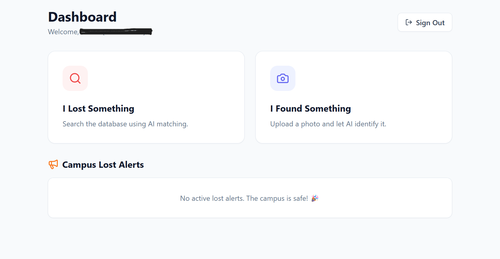

# 🕵️‍♂️ FoundIT - SASTRA University Lost & Found

> **InnovHack 2025 Submission** > A smart, AI-powered platform connecting students to recover lost belongings efficiently.

  

## 🚀 The Problem
College campuses are chaotic. Students lose IDs, wallets, and gadgets daily. Existing solutions (WhatsApp groups, notice boards) are unorganized, spammy, and ineffective.

## 💡 The Solution: FoundIT
**FoundIT** is a centralized web app restricted to SASTRA students. It uses **Google Gemini AI** to automatically tag found items and match them with lost reports, ensuring a hassle-free recovery process.

## ✨ Key Features

### 🤖 1. AI-Powered "Found" Reporting
- Upload a photo of a found item.
- **Gemini AI** analyzes the image to extract details (e.g., "Blue", "Electronics", "OnePlus").
- No manual typing required!

### 🔍 2. Smart Search & Matching
- Users describe what they lost (e.g., "I lost my black wallet").
- The system performs a **semantic keyword match** against the database.
- Results are filtered to show only high-confidence matches (>2 keywords).

### 📢 3. Campus Broadcast & Alerts
- If an item isn't found immediately, users can **Broadcast a Lost Alert** to the main dashboard.
- Real-time updates for the entire campus community.

### 🛡️ 4. Security Handover Protocol (Unique!)
- To prevent students from hoarding found items, the app tracks inventory age.
- If an item is unclaimed for **7 days**, the finder gets a **"Red Alert"** to drop it at the Main Guard Gate.
- Status updates to "At Security" so the owner knows where to go.

### 🔒 5. Verified Access
- Restricted login to college mail domains only.
- Ensures safety and accountability.

---

## 🛠️ Tech Stack

- **Frontend:** React.js, Tailwind CSS (via CDN)
- **Backend/DB:** Firebase Firestore & Authentication
- **AI Engine:** Google Gemini API (Multimodal Vision)
- **Icons:** Lucide React

---

## ⚙️ Installation & Setup

1. **Clone the repository**
   ```bash
   git clone [https://github.com/666-avocado/Found-IT.git](https://github.com/666-avocado/Found-IT.git)
   cd Found-IT

2. **Install Dependencies**
    ```bash
    npm install

3. **Configure Environment Variables**
    - Rename .env.example to .env.
    - Add your API keys (Firebase & Gemini).
    ```Code snippet
        REACT_APP_GEMINI_API_KEY=your_key_here
        REACT_APP_FIREBASE_API_KEY=your_key_here
    
4. **Run the App**
    ```bash
    npm start   

## 📱 Screenshots
**Found Upload**

**Lost Search**

## Contributors
- Yuvan - Lead Developer
    
**Built with ❤️ for InnovHack 2025**
    
